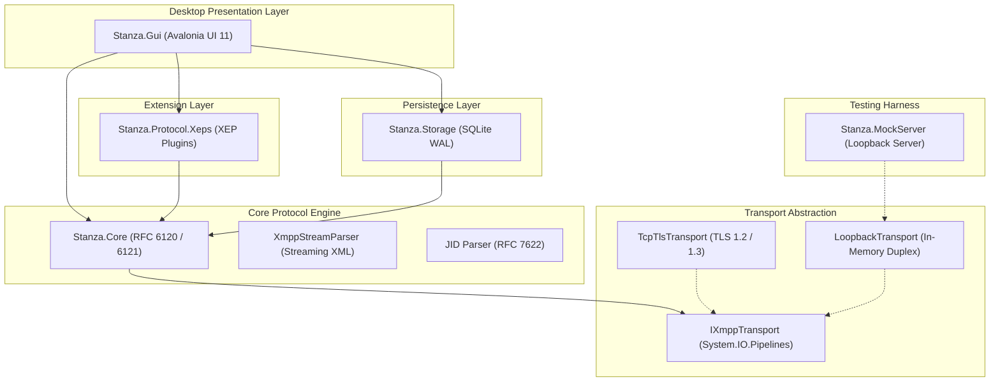
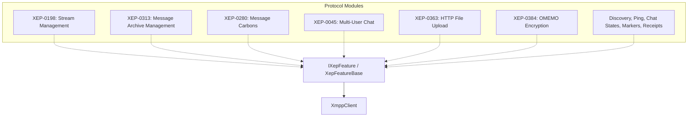
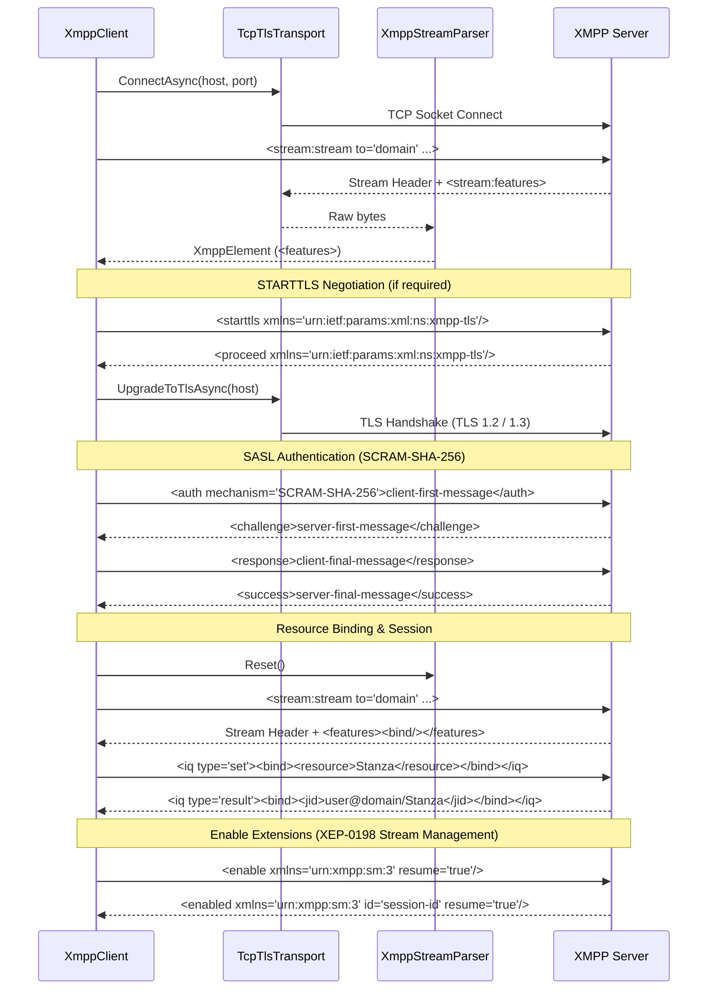
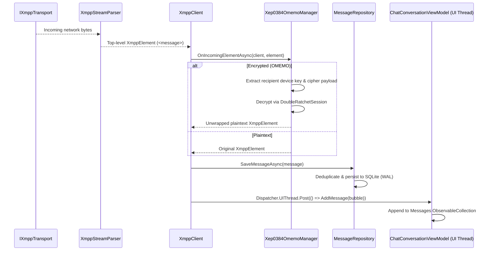
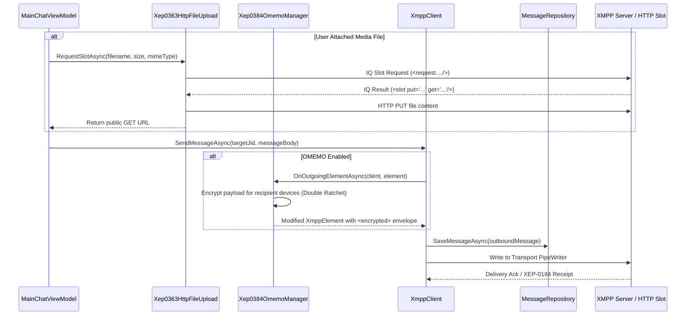

# Stanza Architecture Documentation

This document describes the architectural design, component layers, data pipelines, and design principles of **Stanza**, a modern, cross-platform XMPP desktop client built on **.NET 10** and **Avalonia UI 11**.

---

## Table of Contents

- [Architectural Principles](#architectural-principles)
- [System Architecture Overview](#system-architecture-overview)
- [Component Breakdown](#component-breakdown)
  - [1. Stanza.Core (Protocol Engine & Transport)](#1-stanzacore-protocol-engine--transport)
  - [2. Stanza.Protocol.Xeps (Protocol Extensions)](#2-stanzaprotocolxeps-protocol-extensions)
  - [3. Stanza.Storage (Embedded Persistence)](#3-stanzastorage-embedded-persistence)
  - [4. Stanza.Gui (Desktop Presentation & Desktop Interop)](#4-stanzagui-desktop-presentation--desktop-interop)
  - [5. Stanza.MockServer (Test Harness)](#5-stanzamockserver-test-harness)
- [Data Flow & Lifecycle Sequences](#data-flow--lifecycle-sequences)
  - [Connection & Authentication Flow](#connection--authentication-flow)
  - [Inbound Stanza & Decryption Pipeline](#inbound-stanza--decryption-pipeline)
  - [Outbound Message & HTTP Upload Flow](#outbound-message--http-upload-flow)
- [Threading & Concurrency Model](#threading--concurrency-model)
- [Native AOT & Trimming Architecture](#native-aot--trimming-architecture)

---

## Architectural Principles

Stanza is engineered around the following core architectural pillars:

1. **High Throughput & Non-Blocking Asynchronous I/O**:
   All networking, XML framing, and data parsing use `System.IO.Pipelines` and UTF-8 memory spans, eliminating blocking threads and minimizing memory allocations during continuous stream processing.
2. **Decoupled Pipeline & Filter Extensibility**:
   The core XMPP engine (`Stanza.Core`) is strictly decoupled from protocol extensions (`Stanza.Protocol.Xeps`) via bi-directional stanza pipeline filters (`IIncomingStanzaFilter`, `IOutgoingStanzaFilter`).
3. **Strict UI Thread Isolation**:
   The desktop UI (`Stanza.Gui`) renders via Avalonia UI 11 using MVVM. Networking, cryptographic Double Ratchet operations, SQLite transactions, and image decoders operate strictly on background thread pool workers, marshalling to the UI thread only when updating observable collections or visual properties.
4. **Native AOT & Trimming Compatibility**:
   Every project is trim-safe (`<IsTrimmable>true</IsTrimmable>`, `<IsAotCompatible>true</IsAotCompatible>`) and the application compiles to Native AOT (`PublishAot=true`). Dynamic reflection, unconstrained runtime type emissions, and reflection-based serializers are strictly avoided in favor of compile-time Roslyn source generators and compiled XAML bindings.
5. **Zero-Network In-Memory Testability**:
   `Stanza.MockServer` and `LoopbackTransport` allow end-to-end integration and unit testing of full protocol handshakes, SASL negotiation, and MAM synchronization entirely in memory without socket I/O.

---

## System Architecture Overview

The Stanza repository is organized into layered assemblies with clear separation of concerns:

### Dependency Hierarchy
- `Stanza.Gui` references `Stanza.Core`, `Stanza.Storage`, and `Stanza.Protocol.Xeps`.
- `Stanza.Protocol.Xeps` references `Stanza.Core` and cryptographic dependencies (`BouncyCastle.Cryptography`).
- `Stanza.Storage` references `Stanza.Core` and SQLite (`Microsoft.Data.Sqlite`).
- `Stanza.Core` has no project dependencies and targets pure protocol abstractions.
- `Stanza.MockServer` references `Stanza.Core` and provides loopback testing utilities.

---

## Component Breakdown

### 1. Stanza.Core (Protocol Engine & Transport)

`Stanza.Core` implements the core XMPP specifications defined by RFC 6120 (XMPP Core), RFC 6121 (Instant Messaging & Presence), and RFC 7622 (JID Syntax).

#### RFC 7622 JID Parser (`Jid.cs`)
- Encapsulates Jabber Identifiers in the form `[localpart@]domainpart[/resourcepart]`.
- Implements RFC 7622 PRECIS stringprep rules, lowercasing domain parts, and handling bare vs. full JID distinctions.
- Immutable, memory-efficient, and supports equality, hash codes, and sorting (`IEquatable<Jid>`, `IComparable<Jid>`).

#### Streaming XML State Machine (`XmppStreamParser.cs`)
- Unlike traditional DOM parsers (`XmlDocument`, `XDocument`), `XmppStreamParser` processes XMPP XML as a continuous, unbounded stream over a `PipeReader`.
- Implements an asynchronous push/pull state machine that frames incoming chunks:
  - Detects initial stream opening `<stream:stream ...>`.
  - Parses top-level root stanzas (`<message>`, `<iq>`, `<presence>`) into lightweight `XmppElement` trees.
  - Detects stream termination `</stream:stream>`.
- Preserves namespaces, attributes, inner text, and child hierarchy with low heap allocations.

#### Transport Abstraction (`IXmppTransport.cs`)
- Exposes `PipeReader Input` and `PipeWriter Output` abstractions powered by `System.IO.Pipelines`.
- Implementations:
  - `TcpTlsTransport`: Connects over TCP sockets, negotiates TLS 1.2/1.3 via `SslStream`, and supports STARTTLS upgrades and Direct TLS (port 5223).
  - `LoopbackTransport`: Dual in-memory pipes connecting client and mock server without socket or OS networking overhead.

#### SASL Authentication (`ISaslMechanism.cs`)
- Pluggable SASL authentication engine supporting:
  - `PlainSaslMechanism`: RFC 4616 SASL PLAIN.
  - `ScramSaslMechanism`: RFC 5802 / RFC 7677 SCRAM-SHA-1 and SCRAM-SHA-256 with cryptographic nonce generation, salted hash iteration, client proof generation, and server signature verification.

#### Stanza Pipeline Filters (`IStanzaPipelineFilter.cs`)
- Provides extension hooks:
  - `IIncomingStanzaFilter`: Intercepts and parses incoming elements before general dispatch. Filters can consume stanzas to prevent further propagation.
  - `IOutgoingStanzaFilter`: Inspects, modifies, or annotates outgoing elements before serialization to the wire.
- Allows XEP modules to seamlessly hook into the message pipeline without polluting core connection handling.

#### XMPP Client Coordinator (`XmppClient.cs`)
- Coordinates connection state transitions (`Disconnected`, `Connecting`, `Connected`, `Authenticated`).
- Manages keepalive pings, IQ request-response correlations via unique `id` tracking, and stanza dispatch to registered event handlers and pipeline filters.

---

### 2. Stanza.Protocol.Xeps (Protocol Extensions)

`Stanza.Protocol.Xeps` contains modular implementations of XMPP Extension Protocols (XEPs) adhering to XSF standards. Each feature extends `XepFeatureBase` and registers incoming/outgoing filters onto `XmppClient`.

#### Major XEP Implementations:

1. **XEP-0198 (Stream Management)**:
   - Tracks outbound and inbound stanza sequence counters (`<a h='...'/>`, `<r/>`).
   - Retains unacknowledged stanzas in an outbound buffer.
   - On transient network disconnection, initiates stream resumption (`<resume previd='...' h='...'/>`) to recover missed stanzas without dropping the user session.
2. **XEP-0313 (Message Archive Management - MAM v2)**:
   - Fetches historical message archives from the server upon initial sync or conversation scrollback.
   - Integrates **XEP-0059 (Result Set Management - RSM)** to paginate forward and backward through history.
   - Automatically correlates forwarded messages (`<forwarded>`) to avoid duplicating live incoming messages.
3. **XEP-0280 (Message Carbons)**:
   - Synchronizes outgoing and incoming messages across all connected resources of the same bare JID (`<sent>`, `<received>`).
4. **XEP-0045 (Multi-User Chat - MUC)**:
   - Manages room joins (`<presence to='room@muc/nick'>`), occupant roster tracking, affiliation and role updates, subject changes, and private/group messages.
   - Supports **XEP-0249** direct invitations.
5. **XEP-0363 (HTTP File Upload)**:
   - Discovers HTTP upload slots via Service Discovery (XEP-0030).
   - Requests upload slots (`<request xmlns='urn:xmpp:http:upload:0'>`) and receives presigned `put` and `get` URLs with required headers.
   - Performs asynchronous streaming HTTP PUT uploads and generates preview-ready URLs.
6. **XEP-0384 (OMEMO Multi-Device Encryption)**:
   - Implements the **Signal Double Ratchet** protocol using Curve25519, AES-128-GCM, and HKDF (`OmemoCrypto.cs`, `DoubleRatchetSession.cs`).
   - Manages PEP (XEP-0060) prekey bundle publication (identity key, signed prekey, one-time prekeys).
   - Encapsulates message payloads using **XEP-0420 (Stanza Content Encryption - SCE)** inside encrypted envelopes (`<encrypted xmlns='urn:xmpp:omemo:2'>`).
   - Provides forward secrecy and break-in recovery.
7. **Auxiliary Extensions**:
   - **XEP-0030**: Service Discovery (`disco#info`, `disco#items`).
   - **XEP-0199**: XMPP Ping & latency monitoring.
   - **XEP-0352**: Client State Indication (active / inactive states for bandwidth/battery optimization).
   - **XEP-0085**: Chat State Notifications (`composing`, `paused`, `active`, etc.).
   - **XEP-0184**: Message Delivery Receipts (`urn:xmpp:receipts`).
   - **XEP-0333**: Chat Markers (`received`, `displayed`, `acknowledged`).
   - **XEP-0308**: Last Message Correction (message editing).
   - **XEP-0359**: Unique and Stable Stanza IDs (`origin-id` and `stanza-id`).
   - **XEP-0393**: Message Styling (formatting directives).
   - **XEP-0424**: Message Retraction.
   - **XEP-0444**: Message Reactions.
   - **XEP-0084 / XEP-0153**: User Avatars (vCard and PEP-based avatar hashes).

---

### 3. Stanza.Storage (Embedded Persistence)

`Stanza.Storage` provides SQLite-based local persistence powered by `Microsoft.Data.Sqlite`.

#### Database Configuration & WAL Mode
- Configured with `PRAGMA journal_mode = WAL;` (Write-Ahead Logging) and `PRAGMA synchronous = NORMAL;`.
- WAL mode allows concurrent readers without blocking writers, ensuring UI queries never stall on background message synchronization.
- Automatically bootstraps schema using embedded SQL resource `schema.sql`.

#### Repositories:
- **`MessageRepository`**:
  - Stores inbound and outbound messages (`messages` table).
  - Maintains indexes on `(account_jid, remote_jid, timestamp)`, `stanza_id`, and `origin_id`.
  - Performs intelligent deduplication to prevent duplicate message entries during simultaneous MAM syncing and live stream arrival.
  - Manages message reactions (`message_reactions` table) and chat read markers (`chat_read_markers` table).
- **`RosterRepository`**:
  - Stores contact list entries, display names, subscription status (`to`, `from`, `both`, `none`), and grouping.
- **`AccountRepository`**:
  - Stores account connection profiles: JID, hashed/saved credentials, resource, host, port, TLS settings, and active status.
- **`OmemoRepository`**:
  - Stores local identity keys, device IDs, signed prekeys, one-time prekeys, and active Double Ratchet session states (`omemo_sessions` table).
  - Tracks per-device trust states (`Undecided`, `Trusted`, `Untrusted`).
- **`AvatarRepository`**:
  - Stores binary image blobs for contact avatars indexed by SHA-1 hash, MIME type, and update timestamp.
- **`SettingsRepository`**:
  - Stores key-value user preferences (theme, font size, bubble colors, notification settings, message merging thresholds).

---

### 4. Stanza.Gui (Desktop Presentation & Desktop Interop)

`Stanza.Gui` provides a cross-platform desktop UI built with **Avalonia UI 11**.

#### MVVM Architecture & CommunityToolkit.Mvvm
- Implements strict MVVM pattern:
  - **Views**: XAML layouts (`MainWindow`, `MainChatView`, `SettingsView`, `LoginView`, `CodeBlockEditorView`, `HelpView`, `AboutView`).
  - **ViewModels**: Encapsulate UI state, command handling, and reactive bindings (`MainWindowViewModel`, `MainChatViewModel`, `ChatConversationViewModel`, `MessageBubbleViewModel`).
  - Utilizes source generators (`[ObservableProperty]`, `[RelayCommand]`) for clean, boilerplate-free reactive properties.
- Compiled XAML bindings (`AvaloniaUseCompiledBindingsByDefault = true`) guarantee compile-time type validation and eliminate runtime reflection.

#### UI Thread Isolation
- All network operations, XML parsing, cryptographic ratchets, SQLite queries, and image decoding execute on worker threads via `Task.Run` or asynchronous pipelines.
- UI state updates marshal through `Dispatcher.UIThread.Post(...)` or `Dispatcher.UIThread.InvokeAsync(...)`.

#### Native Platform Interop:
- **Native OS Toast Notifications**:
  - Windows: PowerShell / WinRT native toast dispatch.
  - Linux: D-Bus desktop notification service (`Tmds.DBus.Protocol` / `notify-send`).
  - macOS: AppleScript notification alerts.
- **Clipboard Image Support**:
  - Windows: Native Win32 clipboard interop with support for `CF_DIB` (device-independent bitmaps) and `PNG` streams.
  - Linux & macOS: Cross-platform Avalonia clipboard provider.
- **Window & Taskbar Flashing**:
  - Flashes window title bar and taskbar/dock icon on new incoming messages when the window is inactive.
- **System Resume Watcher**:
  - Detects system sleep/wake transitions (`ISystemResumeWatcher`, `SystemEvents.PowerModeChanged`) to immediately trigger XEP-0199 ping or stream resumption.

---

### 5. Stanza.MockServer (Test Harness)

`Stanza.MockServer` is a lightweight, fully in-memory XMPP server fixture designed for integration testing without external dependencies.

- Communicates through `LoopbackTransport` via in-process `Pipe` instances.
- Simulates complete XMPP connection lifecycles:
  - Stream header negotiation (`<stream:stream ...>`).
  - Feature advertisement (`<stream:features>`).
  - SASL authentication (`PLAIN` and `SCRAM-SHA-256` challenge/response).
  - Resource binding (`<iq type='set'><bind .../></iq>`).
  - Stream Management negotiation (XEP-0198).
  - Roster push/queries, MAM archive playback, IQ ping responses, and stanza echo.
- Powers the test suites in `tests/Stanza.Core.Tests/`, `tests/Stanza.Xeps.Tests/`, `tests/Stanza.Storage.Tests/`, and `tests/Stanza.Gui.Tests/`.

---

## Data Flow & Lifecycle Sequences

### Connection & Authentication Flow

---

### Inbound Stanza & Decryption Pipeline

---

### Outbound Message & HTTP Upload Flow

---

## Threading & Concurrency Model

Stanza enforces a strict separation between background processing and the Avalonia UI render loop:

| Layer | Thread Context | Responsibilities |
| :--- | :--- | :--- |
| **Transport & Parser** | ThreadPool / Asynchronous I/O | `PipeReader` read loops, UTF-8 byte parsing, XML tokenization, TLS encryption. |
| **Protocol & XEPs** | ThreadPool / Task | SASL math, OMEMO Curve25519 ratchet stepping, HTTP uploads, ping timers. |
| **Persistence (Storage)** | ThreadPool / Background Worker | SQLite queries, schema initialization, database write transactions in WAL mode. |
| **ViewModels & UI** | Avalonia UI Thread (`Dispatcher.UIThread`) | Observable collections, property change notifications, window management, animations. |

---

## Native AOT & Trimming Architecture

Stanza is compiled natively to platform machine code using the .NET 10 ILCompiler (`<PublishAot>true</PublishAot>`).

### Architectural Constraints:
- **No Dynamic Reflection**: All serialization and type lookups must be known at compile time.
- **Compiled Bindings**: XAML views utilize `{CompiledBinding}` (`AvaloniaUseCompiledBindingsByDefault = true`) to generate C# binding expressions at compile time.
- **Source Generators**: ViewModels use `CommunityToolkit.Mvvm` Roslyn generators for `INotifyPropertyChanged` and command wiring.
- **Trim Safety**: Assemblies are annotated with `<IsTrimmable>true</IsTrimmable>` and `<IsAotCompatible>true</IsAotCompatible>`.
